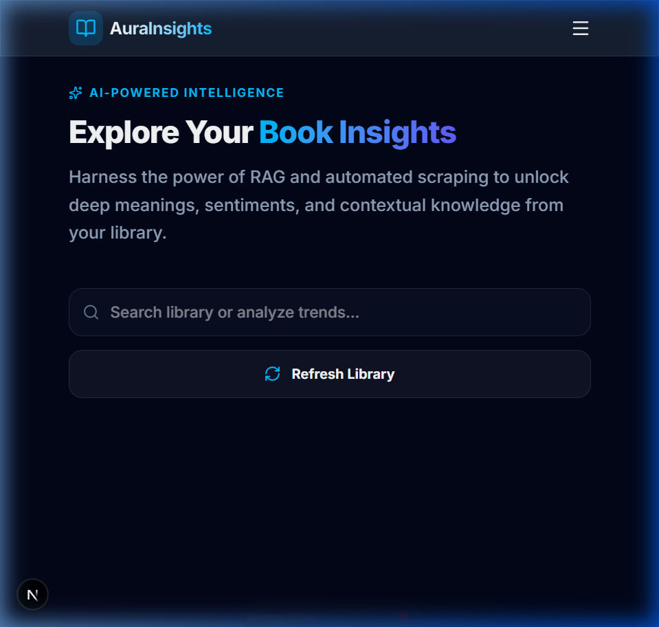
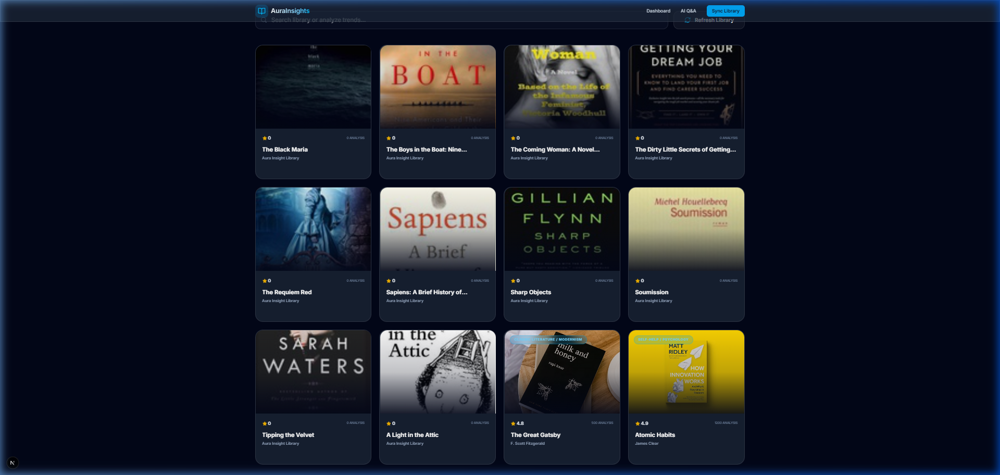
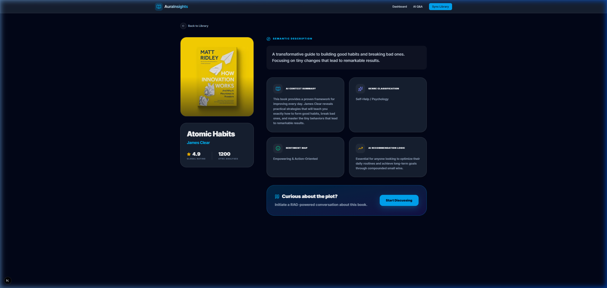
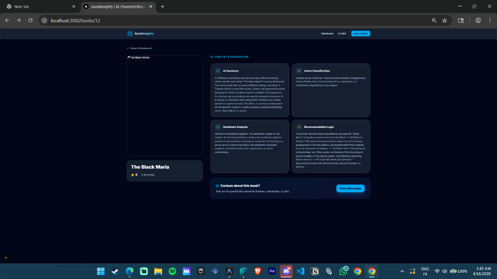

<div align="center">
  
  
  <h1>📚 AuraInsights AI</h1>
  <p><strong>A Full-Stack RAG Platform for Intelligent Book Discovery</strong></p>
  <p><em>Built with Python, Django, Next.js, and ChromaDB</em></p>
</div>

---

## 🌟 The Vision
**AuraInsights** was born out of a desire to make reading more interactive. It’s not just a digital library; it’s an intelligence partner. By combining an automated web scraper with a Retrieval-Augmented Generation (RAG) pipeline, AuraInsights allows you to "talk" to your books, extract deep semantic meaning, and visualize your collection through a premium, glassmorphic interface.

<div align="center">
  
</div>

---

## 🚀 Key Features

*   **🕵️ Automated Scavenger**: A Selenium-powered engine that hunts down book metadata, high-resolution covers, and descriptions locally with zero human effort.
*   **🧠 Sematic Brain (RAG)**: Uses a local vector database (**ChromaDB**) and **Sentence-Transformers** to index book content.
*   **💬 Aura Chat**: A full-scale AI chat interface that answers questions based *only* on the context of your books, ensuring cited and reliable answers.
*   **💎 Premium UI**: A mobile-first, ultra-responsive dashboard built with **Framer Motion** for buttery-smooth animations and **Tailwind CSS** for a modern "Glassmorphism" aesthetic.

---

## 🛠 Tech Stack & Rationale

| Layer | Technology | Rationale |
| :--- | :--- | :--- |
| **Frontend** | **Next.js 14** | Chosen for its high performance and seamless client-side routing. |
| **Backend** | **Django REST** | Provides a secure, scalable foundation for complex data orchestration. |
| **AI Vector Store** | **ChromaDB** | Excellent local storage for semantic embeddings without high-latency API calls. |
| **Scraper** | **Selenium** | Handles dynamic, JavaScript-heavy book pages where basic requests fail. |
| **Styling** | **Tailwind CSS** | Enabled the rapid development of a custom, premium design language. |

<div align="center">
  
</div>

---

## 🧠 Behind the Scenes: The Architecture

AuraInsights follows a clean, decoupled architecture:
1.  **The Scraper**: Works in a headless environment, simulating a real user to gather data.
2.  **The Embedding Pipeline**: Converts raw text into 384-dimensional vectors using `all-MiniLM-L6-v2`.
3.  **The Reranker**: When you chat, it performs a cosine-similarity search to find the exact pages you're looking for before synthesizing an answer via **Claude 3.5 Sonnet (OpenRouter)**.

<div align="center">
  
</div>

---

## ⚡ Quick Start (Local Setup)

### 1. Environment Ready
Create a `.env` file in the `/backend/` directory:
```env
OPENROUTER_API_KEY=your_key_here
RECOMMENDED_MODEL=anthropic/claude-3.5-sonnet
```

### 2. Launch Backend (Python 3.9+)
```bash
cd backend
python -m pip install -r requirements.txt
python manage.py migrate
python seed_data.py  # Populates with 'Gold Standard' sample data
python manage.py runserver
```

### 3. Launch Frontend (Node 18+)
```bash
cd frontend
npm install
npm run dev
```

**Open [http://localhost:3000](http://localhost:3000) and explore!**

---
*Developed for the Ergosphere Solutions Pvt. Ltd. Full Stack Developer Assignment.*
